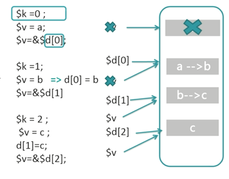

# 引用变量考点

### 一.回顾真题

#### 考题
什么是**引用变量**？在PHP当中，用什么**符号**定义引用变量？

##### 思考

###### 考官考点
PHP的引用变量的概念及定义方式？

    在PHP中引用意味着用不同的名字访问同一个变量内容。定义方式使用 &
###### 延伸考点
PHP引用变量的工作原理

**1.$a会产生一个储存空间，$b=$a，会把$b指向$a的储存空间。如图**
```
$a = range(1,3);//产生一到三三个数；  
// array(3) { [0]=> int(1) [1]=> int(2) [2]=> int(3) }  

$b = $a;
```


**2.给$a重新赋值**

    $a = range(2,4);  

$a的储存空间会被重新指向 ，一个新的被赋值的储M存空间，如图


**3.引用变量的概念和方式**
```
$a="ABC";   
$b =&$a;   
echo $a;//这里输出:ABC
echo $b;//这里输出:ABC   
$b="EFG";   
echo $a;//这里$a的值变为EFG 所以输出EFG echo $b;//这里输出EFG
```
当用引用变量的时候$a和$b的储存空间不会发生变化，会发生修改，如图


**4.unset 只会取消引用，不会销毁内存空间**
```
$a = 1;
$b = &$a;
unset($b);
echo $a; // 1
```
**5.对象本身就是引用传递**
```
class person
{
    public $name = "zhangsan";
}
$p1 = new person();
$p2 = $p1;
$p2 -> name = "lisi";
```


### 二.一网打进

```
写出如下程序输出的结果
<?php

$d = ['a','b','c'];

foreach($d as $key => $val)
{
    $val = &$d[$key];
}

?>

程序运行时，每一次循环后变量$data的值是什么？请解释
程序执行完成后，变量$data的值是什么？请解释

```
`第一次循环`

$k = 0;
$v = a;
$v = &$d[0];


    $d = ['a','b','c'];

`第二次循环`

$k = 1;
$v = b; => d[0] = b;
$v = &$d[1]; //b


    $d = ['b','b','c'];

`第三次循环`

$k = 2;
$v = c; => d[1] = c;
$v = &$d[2]; //c



    $d = ['b','c','c'];

*最终结果*

        $d = ['b','b','c'];
